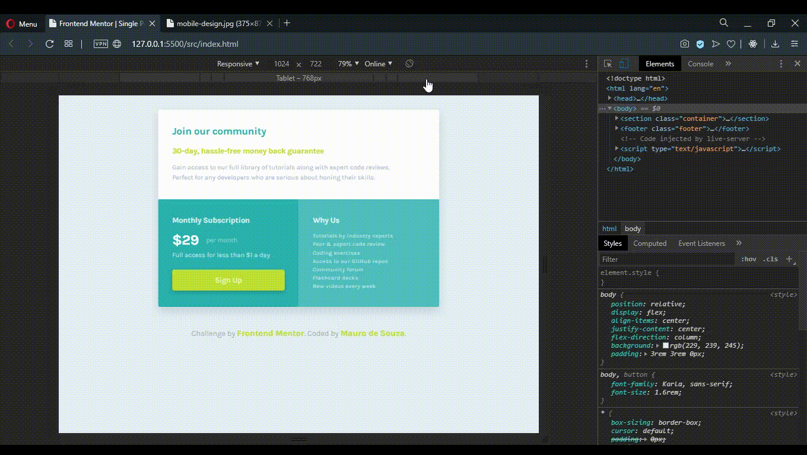
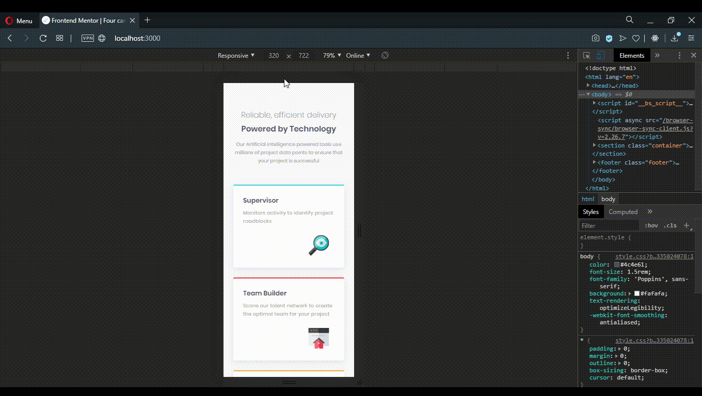
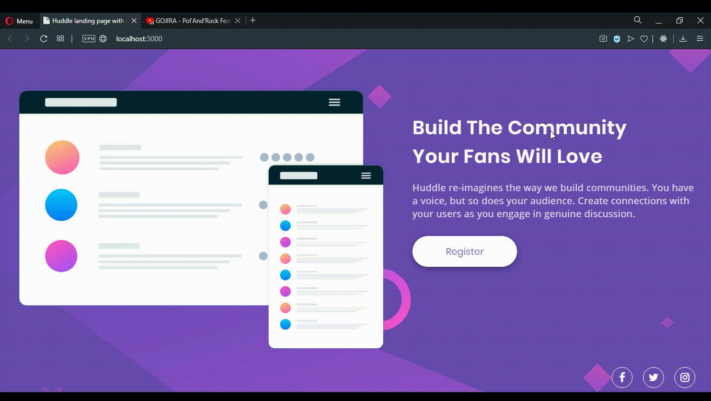
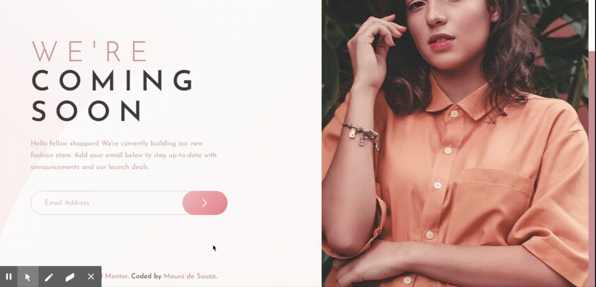
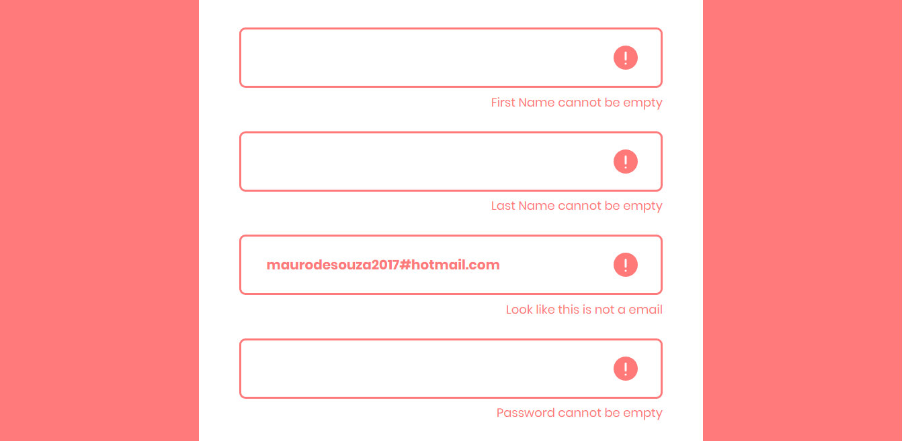

<div id="top" align="center" markdown="1">

# 16 front end project <br /> with desing :tada::tada: #

</div>

Esse repositório vai ser uma série de **16 projetos** que encontrei [aqui!](https://dev.to/frontendmentor/16-front-end-projects-with-designs-to-help-improve-your-coding-skills-5ajl) :point_left::point_left: Em cada projeto vai ser dado uma imagem de um layout e algumas especificações, e o objetivo é fazer esse layout **!!**

Meu principal objetivo :dart: com esses projetos é melhorar minhas skills com css e também para aprender a utilizar essas ferramentas:

- [Pug :dog:](https://pugjs.org/language/tags.html)
- [Sass](https://sass-lang.com)
- [Less](http://lesscss.org)
- [Gulp](https://gulpjs.com)
- [Webpack](https://webpack.js.org)
intro-component-with-signup-form
# Projetos #
**1°** - [single-price-grid-component-master](#single-price-grid-component-master)\
**2°** - [four-card-feature-section-master](#four-card-feature-section-master)\
**3°** - [huddle-landing-page-with-single-introductory-section](#huddle-landing-page-with-single-introductory-section)\
**4°** - [base-apparel-coming-soon](#base-apparel-coming-soon)
**5°** - [intro-component-with-signup-form](#intro-component-with-signup-form)

# single-price-grid-component-master #


O primeiro projeto é esse layout acima :arrow_up::arrow_up: e suas especificações eram:

- Deixar o layout responsivo;
- Colocar um efeito de **Hover** no botão;

Para fazer ele, utilizei o [Gulp](https://gulpjs.com), [Pug :dog:](https://pugjs.org/language/tags.html) para o HTML e para os estilos, o [Sass](https://sass-lang.com) :+1::+1:

Para ver como ficou o resultado, [clique aqui](https://maurodesouza.github.io/16-front-end-project-with-design/single-price-grid-component-master/dist/index.html) :point_left::point_left:

Se quiser ver como ficaram os arquivos, [clique aqui](https://github.com/maurodesouza/16-front-end-project-with-design/tree/master/single-price-grid-component-master/src) :point_left::point_left:



Foi um layout bem simples de fazer, utilizei uma section com **display flex** e **flex-wrap wrap** e dentro coloquei 3 divs, a primeira com width 100% e as outras duas com width 50%.

Para deixar responsivo, apenas adicionei um **flex-direction column** na section e deixei todas as div com width 100%.

[Voltar ao início](#top)

# four-card-feature-section-master #


Para o segundo projeto, temos esse layout acima :arrow_up::arrow_up: suas especificações eram:

- Deixar o layout responsivo;

Para fazer ele, utilizei novamente o [Gulp](https://gulpjs.com), [Pug :dog:](https://pugjs.org/language/tags.html) para o HTML e para os estilos, o [Sass](https://sass-lang.com) :+1::+1:

Para ver como ficou o resultado, [clique aqui](https://maurodesouza.github.io/16-front-end-project-with-design/four-card-feature-section-master/dist/index.html) :point_left::point_left:

Se quiser ver como ficaram os arquivos, [clique aqui](https://github.com/maurodesouza/16-front-end-project-with-design/tree/master/four-card-feature-section-master/src) :point_left::point_left:



Para fazer a parte dos **cards**, utilizei uma div como **container** com **display flex** e **align-items center**, e dentro do container coloquei os 4 cards da seguinte forma:

```html

<container>

  <card-1>

  <div>
    <card-2>
    <card-3>
  </div>

  <card-4>

</container>

```

Para deixar responsivo, apenas coloquei **flex-direction column** no container que segura os cards e diminui um pouco o tamanho das fontes :+1::+1:

[Voltar ao início](#top)

# huddle-landing-page-with-single-introductory-section #


Para o terceiro projeto, temos esse layout acima :arrow_up::arrow_up: e suas especificações eram:

- Deixar o layout responsivo;
- Colocar um efeito de **Hover** em todos os elementos interativos;

Para fazer ele, utilizei o [Gulp](https://gulpjs.com), [Pug :dog:](https://pugjs.org/language/tags.html) para o HTML e para os estilos, o [Less](http://lesscss.org) :+1::+1:

Para ver como ficou o resultado, [clique aqui](https://maurodesouza.github.io/16-front-end-project-with-design/huddle-landing-page-with-single-introductory-section/dist/index.html) :point_left::point_left:

Se quiser ver como ficaram os arquivos, [clique aqui](https://github.com/maurodesouza/16-front-end-project-with-design/tree/master/huddle-landing-page-with-single-introductory-section/src) :point_left::point_left:



Pra fazer esse layout, utilizei uma `section(container)` para centralizar todo o conteúdo, coloquei a imagem e os textos dentro de uma `div(container-content)` com *display flex*, para poder deixar eles lado a lado e para os social icons, usei uma `div(container-icons)` com *display flex* e *justify-content flex-end* :ok_hand::ok_hand:

E para deixar responsivo, coloquei *flex-direction column* no `container-content` e *justity-content center* no `container-icons`, também diminui um pouco o tamanho da logo, da imagem e das fontes!

[Voltar ao início](#top)

# base-apparel-coming-soon #


Para o quarto projeto, temos esse layout acima :arrow_up::arrow_up: e suas especificações eram:

- Deixar o layout responsivo;
- Colocar um efeito de **Hover** em todos os elementos interativos;
- Receber uma mensagem de erro no submit do form se:
  - O campo do input estiver vazio;
  - O email não tiver formatado corretamente;

Para fazer ele, utilizei o [Gulp](https://gulpjs.com), [Pug :dog:](https://pugjs.org/language/tags.html) para o HTML e para os estilos, o [Less](http://lesscss.org) :+1::+1:

Para ver como ficou o resultado, [clique aqui](https://maurodesouza.github.io/16-front-end-project-with-design/base-apparel-coming-soon/dist/index.html) :point_left::point_left:

Se quiser ver como ficaram os arquivos, [clique aqui](https://github.com/maurodesouza/16-front-end-project-with-design/tree/master/base-apparel-coming-soon/src) :point_left::point_left:


Nesse layout eu senti um pouco mais de dificuldade por causa da imagem, principalmente para deixar responsivo :sleeping::sleeping:

Para fazer ele, utilizei uma `section(container)` com um *max-width 1440px* para deixar todo conteúdo centralizado e também usei um *display grid* com duas colunas.

Para deixar responsivo, passei o `container` para *display flex* com `flex-direction column` e `align-items center` :ok_hand::ok_hand:

Para fazer a parte da 'mensagem de erro', adicionei um *event listener* de *submit* no form, que verifica se a formatação do email está correta através de uma regex `/\S+@\S+\.\S+/`, e também se o input esta vazio. Se cair em alguma dessas verificações, é adicionado uma classe de 'erro' no input.



Também criei um script para corrigir a imagem de background que coloquei no body, que dependendo se tinha ou não scrollbar, não preenchia a tela inteira.

<div align="center">
  <div style="border: 1px solid black;display: inline-block;">

  

  </div>
</div>
&nbsp;

Para corrigir, verifico se a pagina criou o scroll, caso tenha criado, mudo o height do body para 100%, caso o contrário deixo o height com 100vh.

[Voltar ao início](#top)

# intro-component-with-signup-form #


Para o quinto projeto, temos esse layout acima :arrow_up::arrow_up: e suas especificações eram:

- Deixar o layout responsivo;
- Colocar um efeito de **Hover** em todos os elementos interativos;
- Receber uma mensagem de erro no submit do form se:
  - O campo do input estiver vazio;
  - O email não tiver formatado corretamente;

Para fazer ele, utilizei o [Webpack](https://webpack.js.org) e para os estilos, o [Less](http://lesscss.org) :+1::+1:

Para ver como ficou o resultado, [clique aqui](https://maurodesouza.github.io/16-front-end-project-with-design/intro-component-with-signup-form/dist/index.html) :point_left::point_left:

Se quiser ver como ficaram os arquivos, [clique aqui](https://github.com/maurodesouza/16-front-end-project-with-design/tree/master/intro-component-with-signup-form/src) :point_left::point_left:


Para fazer ele, utilizei uma `section(container)` com um *max-width 1100px* para deixar todo conteúdo centralizado e também usei um *display flex* para colocar os textos e o formulário lado a lado.

Para deixar responsivo, adicionei ao `container` um `flex-direction column` :ok_hand::ok_hand:

Para fazer a parte da 'mensagem de erro', adicionei um *event listener* de *submit* no form, que verifica se a formatação do email está correta através de uma regex `/\S+@\S+\.\S+/`, e também se cada input esta vazio. Se cair em alguma dessas verificações, é adicionado uma classe de 'erro' no input e também é colocado um span em baixo do input contendo a mensagem de erro.



Também criei um script para fazer os inputs do formulário :+1::+1:

[Voltar ao início](#top)

---

Feito com :heart: by Mauro de Souza - Email: maurodesouza2017@hotmail.com